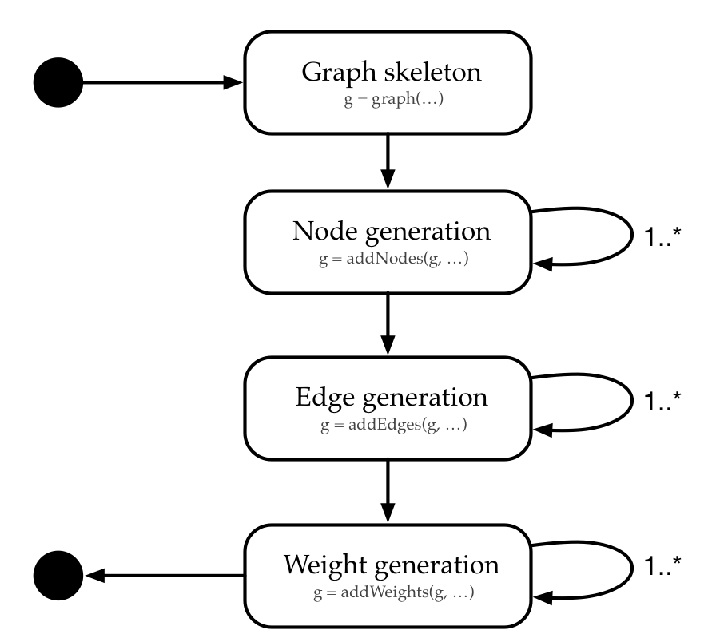
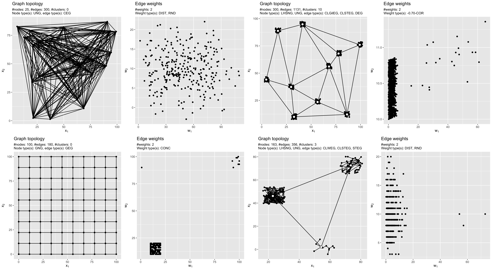

# Summary

Performance of heuristic graph algorithms for hard graph problems, e.g., Travelling-Salesperson-Problem or multi-criteria Minimum-Spanning-Tree-Problem, is typically studied by performing experiments on random graphs. 

The `R` [@R] package [`grapherator`](https://github.com/jakobbossek/grapherator) implements different methods for random graph generation. The focus is on weighted graphs with one or more weights per edge. Grapherator thus targets researchers who study single- or multi-criteria optimization problems on graphs.
The technical pipeline (see Figure 1) follows a three-step approach: 1) node generation (e.g., lattice, uniform etc.), 2) edge generation (Erdos-Renyi [@ER59], Waxman-model [@W88] etc.) and 3) weight generation (distance-based, random, correlated etc.). Each step may be repeated multiple times with different generator functions allowing for high flexibility (see Figure 2 for some examples). The set of predefined generator functions can be easily expanded with custom functions.

## Support

Bug reports and feature requests are highly appreciated via the GitHub issue tracker (<https://github.com/jakobbossek/grapherator/issues>).

# References
