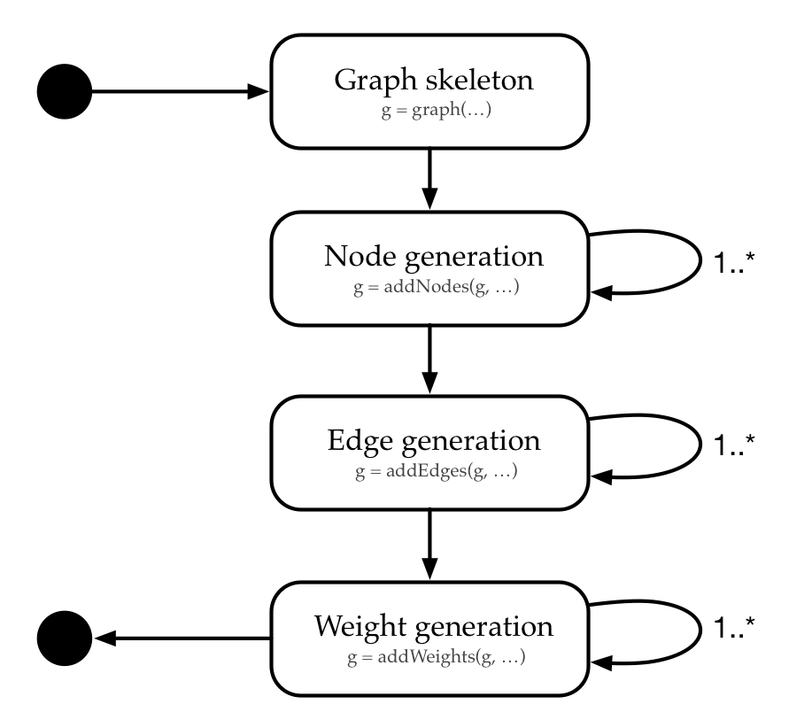

```{r, echo = FALSE}
knitr::opts_chunk$set(collapse = T, comment = "#>", warning = FALSE, message = FALSE, fig.align = "center")
options(tibble.print_min = 4L, tibble.print_max = 4L)
```

# Introduction

Benchmarking algorithms for (combinatorial) optimization problems is usually carried out by running the set of algorithms on a set of test problems. Often, due to lack of real-world data, the test set consists of artificially generated benchmark problems. Artificial problems allow for 1) the generation of arbitrary many instances in short time and 2) the generation of problems of different hardness levels by implementing theoretical knowledge.

# Grapherator workflow

The **grapherator** package implements a modular approach graph generation. An (extensible) set of node, edge and weight generators allows for fast and convenient graph generation following a three step approach.

1) **Node generation**: here the network topology is definined by placing points in the Euclidean plane.
2) **Edge generation**: Links between nodes are established.
3) **Weight generation**: Costs/weights are assigned to each edge.

Each of the steps may be repeated multiple times (e.g., first some nodes which serve as cluster centers are added before the clusters are filled with nodes in a subsequent step). Once step is entered, none of the preceding steps is possible. E.g., once some edges are added no more nodes may be added. The process is illustrated in the following diagram.

```{r, echo = FALSE, out.width = '75%', fig.align = 'center'}

```

The following code supports the workflow diagram with a first example. Here we generate a complete graph with n = 20 nodes placed uniformly at random in the square [0, 10] x [0, 10]. Two weights are assigned to each edge (both weights are drawn from a U(5, 10)-distribution).

```{r, fig.width=8, out.width='100%', fig.cap='Example network.'}
library(grapherator)
set.seed(1) # reproducability
g = graph(lower = 0, upper = 10)
g = addNodes(g, n = 20, generator = addNodesUniform)
g = addEdges(g, generator = addEdgesComplete)
g = addWeights(g, generator = addWeightsRandom, method = runif, min = 5, max = 10)
g = addWeights(g, generator = addWeightsRandom, method = runif, min = 5, max = 10)
print(g)
do.call(gridExtra::grid.arrange, c(plot(g), list(nrow = 1)))
```

# Generators

For each step there exist several preimplemented generator functions which are passed as *generator* argument to on addNodes, addEdges or addWeights respectively. Next, we give an incomprehensive overview of some generators to get an impression of what **grapherator** is capable of.

## Node generators

1. **Uniform node generator**: Nodes / node coordinates are placed uniformly at random within the bounds.
2. **LHS generator**: A Latin-Hypercube-Sample (LHS) is used to place nodes in the Euclidean plane. This is useful if one aims to place cluster centers in a space-filling manner.

## Edge generators

1. **Gilbert edge generator**: Each edge is added independently with some probability p. This way one can generate Gilbert-graphs G(n, p).
2. **Delauney edge generator**: The set of edges added to the graph is based on a Delauney triangulation of the node coordinates.
3. **Complete edge generator**: All n(n-1)/2 edges are added.

## Weight generators

1. **Random weight generator**: Edge weights are assigned randomly following a parameterizable probability distribution.
2. **Correlated weight generator**: Generates two weights per edge. The first weight corresponds to the Euclidean distance between the nodes. The second weight is generated in a way, that both weights are correlated with a predefined correlation rho.

## Examples

Here, 50 nodes are placed uniformly at random in the square [0, 100] x [0, 100]. Edges are based on a Delauney triangulation. Both weights are random. The first weight is sampled from a uniform distribution U(10, 20), the second one follows a Gaussian distribution N(10, 2).

```{r, fig.width=8, out.width='100%', fig.cap='Example network.'}
library(grapherator)
set.seed(1) # reproducability
g = graph(lower = 0, upper = 100)
g = addNodes(g, n = 50, generator = addNodesUniform)
g = addEdges(g, generator = addEdgesDelauney)
g = addWeights(g, generator = addWeightsRandom, method = runif, min = 10, max = 20)
g = addWeights(g, generator = addWeightsRandom, method = rnorm, mean = 10, sd = 2)
print(g)
do.call(gridExtra::grid.arrange, c(plot(g), list(nrow = 1L)))
```

In the following example a clustered graph with 7 clusters is generated. Cluster centers are based on a min-max Latin-Hypercube-Sample (LHS). In a subsequent step, each 29 further points are added to each cluster by samling from a uniform distribution U(0, 5) around the cluster center. Edges are based on Waxman's model with parameters alpha = 0.3, beta = 0.1. Weights are correlated with negative correlation rho = -0.7.

```{r, fig.width=8, out.width='100%', fig.cap='Example network.'}
library(grapherator)
set.seed(1) # reproducability
g = graph(lower = 0, upper = 100)
g = addNodes(g, n = 7, generator = addNodesLHS)
g = addNodes(g, n = 29, by.centers = TRUE, generator = addNodesUniform, lower = c(0, 0), upper = c(10, 10))
g = addEdges(g, generator = addEdgesWaxman, alpha = 0.3, beta = 0.1)
g = addWeights(g, generator = addWeightsCorrelated, rho = 0.7)
print(g)
do.call(gridExtra::grid.arrange, c(plot(g), list(nrow = 1L)))
```

The last example is a another clustered network. Here, 5 cluster centers are placed manually by providing the center coordinates. Next, each cluster is crowded with 10 nodes by sampling node coordinates from a N(1, 0.2)-distribution each. Edges are added in two steps: first we add edges for each cluster seperately at random. In addition -- to ensure connectivity -- we add edges with the spanning tree edge generator. Next, the cluster centers are linked with another generator. The first weight is the Manhattan distance between the nodes in the plane. The second follows an exponential distribution with rate = 0.1.

```{r, fig.width=8, out.width='100%', fig.cap='Example network.'}
library(grapherator)
set.seed(1) # reproducability
g = graph(lower = 0, upper = 100)
g = addNodes(g, n = 5, coordinates = matrix(c(10, 10, 20, 20, 30, 30, 10, 20, 40, 10), byrow = 2, ncol = 2))
g = addNodes(g, n = 10, by.centers = TRUE, generator = addNodesNormal, x.mean = 5, y.mean = 5, x.sd = 2, y.sd = 2, lower = c(0, 0), upper = c(10, 10))
g = addEdges(g, generator = addEdgesGilbert, p = 0.2, type = "intracluster")
g = addEdges(g, generator = addEdgesSpanningTree, type = "intracluster")
g = addEdges(g, generator = addEdgesDelauney, type = "intercluster")
g = addWeights(g, generator = addWeightsDistance, method = "manhattan")
g = addWeights(g, generator = addWeightsRandom, method = rexp, rate = 0.1)
print(g)
do.call(gridExtra::grid.arrange, c(plot(g), list(nrow = 1L)))
```
